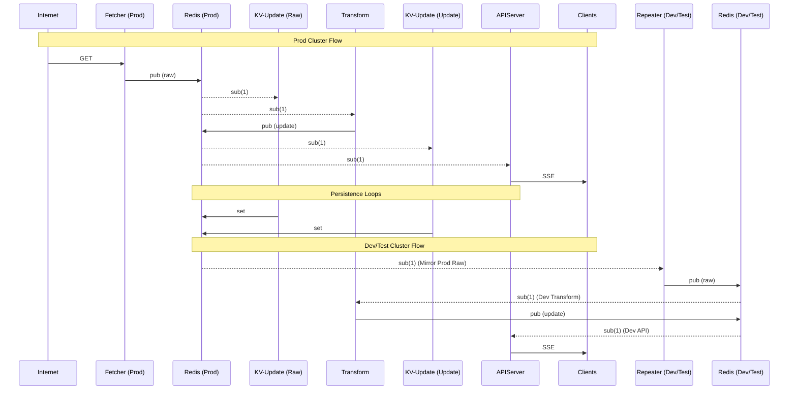
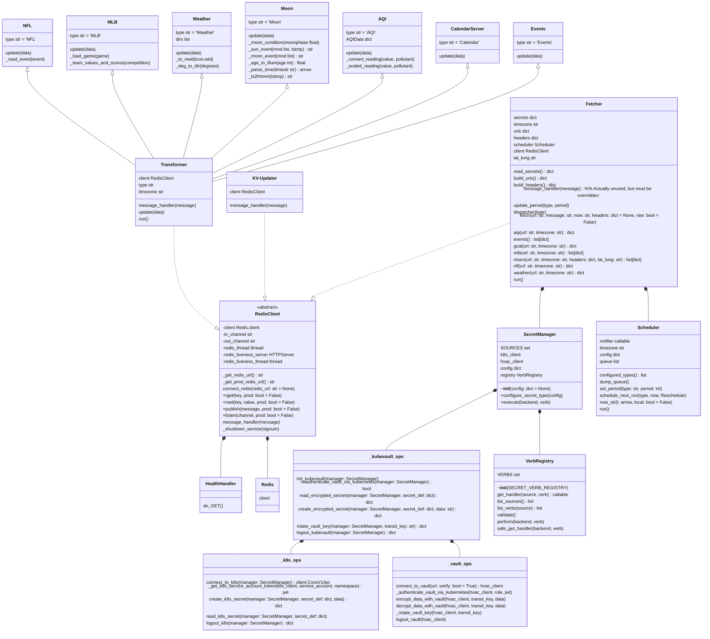

# Fetcher
A newer architecture implementing my signboard services.

## The Problem(s)
Several of my internet data sources are metered (and I'm cheap). In the previous architecture, the _per data source_ microservices each fetched their individual source of data.  If I wanted to add new features, or investigate bugs (and not over-subscribe to the source), I had to 'test in prod'. Clearly this is a 'less than ideal' method. Another issue this architecture addressed was the spread of secrets - with each microservice needing a secret or two (API key, token, etc.) for the metered services.

## the Solution
Consolidate the fetching of the raw data sources.  This consolidates all of the secrets to just one container, and allows deterministic scheduling of the various sources - guaranteeing one source is fetched at a time.  The new transformers (stripped down microservices) listen to the 'raw' channel, transform the raw data, and publish on the update channel. KV-Updater is run in two configurations (from a single image) - one to persist the 'raw' messages from fetcher, and one to persist 'update' messages from the transformers. The apiserver still subscribes to the update channel, and streams to the clients via SSE. And finally, by publishing the raw data fetched from each source, a `repeater` was possible - taking the place of the fetcher in dev and test - subscibing to the raw channel from the prod Redis, and publishing it to the raw channel of its local (dev or test) Redis - with all of the other services running as usual in dev or test - oblivious to the fact that they're not running in prod!  If I want to try out something new (bug fix or new feature) in a kv-updater, transformer, apiserver, or client I can do that in dev without upsetting prod in the slightest.

### Event trace

### 🔐 Secret Hardening & Zero Trust
While consolidating fetching into a single container reduces "secret sprawl", it creates a high-value target. To mitigate this, this project is designed to be paired with the secretmanager blueprint to move from simple consolidation to a Zero Trust security model.

By integrating the secretmanager framework, the fetcher achieves the following:

- Eliminating "Secret Zero": Instead of relying on static environment variables or mounted volumes which can be leaked, the system leverages HashiCorp Vault to bootstrap secrets without ever exposing a standing credential.
- Encryption-as-a-Service: Secrets are not stored in plain text within Kubernetes. They are stored as Vault-encrypted ciphertext (AES-256) and are only decrypted in memory during the container's init routine.
- Ephemeral Lifecycles: To minimize the window of exposure, decrypted secrets exist only as ephemeral Python objects and are never written to disk.
- Eternal Security via Rotation: The security posture is maintained automatically using recryptonator.py, which can be run as a Kubernetes CronJob to rotate Vault Transit keys and re-encrypt the secret store periodically (monthly in my usage).

## Other significant changes
- All of the components are now housed in this single repository
- All of the components share a single [Dockerfile](Dockerfile), and are all built into docker images from a single [build](builder/README.md) process that only builds the conatiners necessary based on source file change dates.
- I've added a simple [recorder](recorder) to logs messages of a given type, from either `raw` or `update` to support development/troubleshooting (a WorldCup transformer most recently)
- A Helm [chart](helm/microservices/) has been created allowing a single call to deploy Redis, fetcher (or repeater), kv-updaters, trasnformers, and the apiserver
- (deprecated) All of the YAML files (deployment, service, ingress, etc.) are all linked from the components subdirectory to a central [yaml](yaml) folder

## Python Classes

