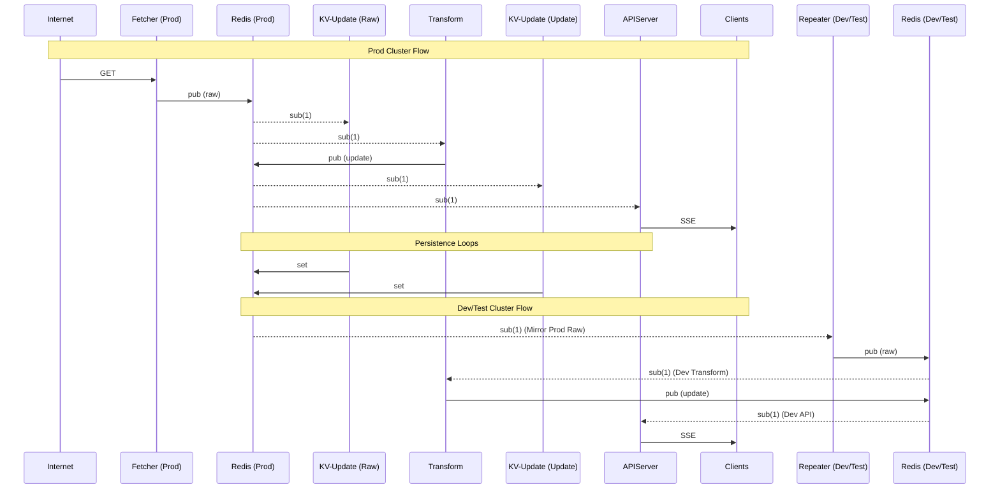

```mermaid
sequenceDiagram
    participant Int as Internet
    participant F as Fetcher (Prod)
    participant RP as Redis (Prod)
    participant KV_R as KV-Update (Raw)
    participant T as Transform
    participant KV_U as KV-Update (Update)
    participant API as APIServer
    participant C as Clients

    Note over Int, C: Prod Cluster Flow
    Int->>F: GET
    F->>RP: pub (raw)
    RP-->>KV_R: sub(1)
    RP-->>T: sub(1)
    T->>RP: pub (update)
    RP-->>KV_U: sub(1)
    RP-->>API: sub(1)
    API->>C: SSE

    Note over RP, API: Persistence Loops
    KV_R->>RP: set
    KV_U->>RP: set

    Note over RP, C: Dev/Test Cluster Flow
    participant Rep as Repeater (Dev/Test)
    participant RD as Redis (Dev/Test)
    
    RP-->>Rep: sub(1) (Mirror Prod Raw)
    Rep->>RD: pub (raw)
    RD-->>T: sub(1) (Dev Transform)
    T->>RD: pub (update)
    RD-->>API: sub(1) (Dev API)
    API->>C: SSE
```